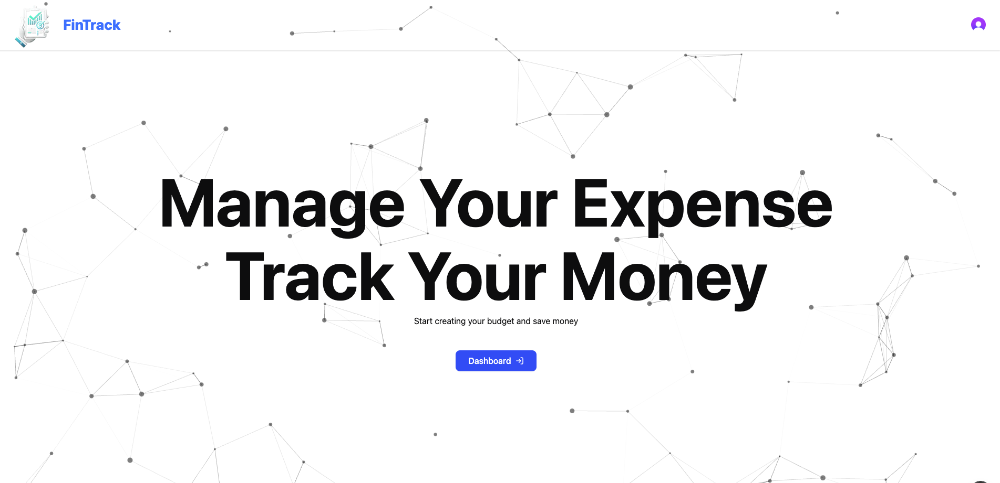
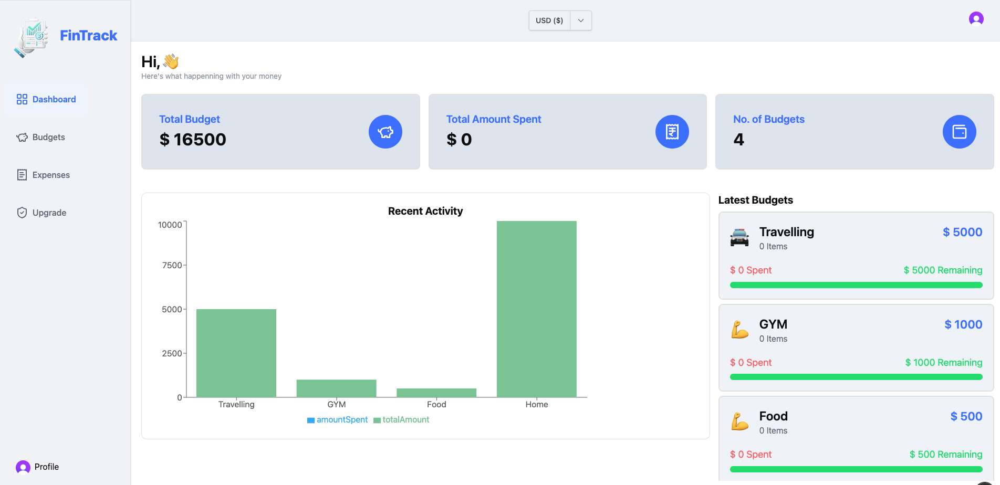
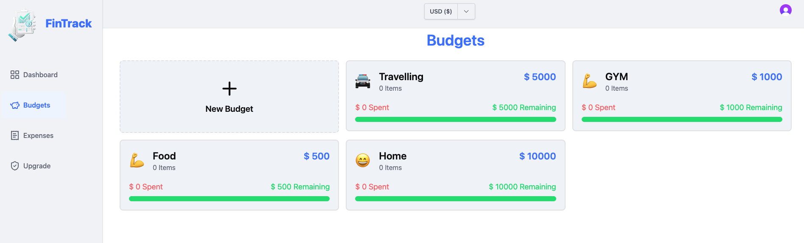
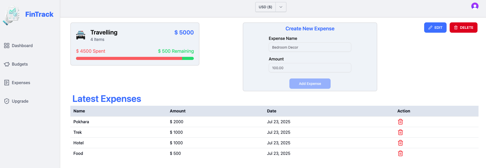
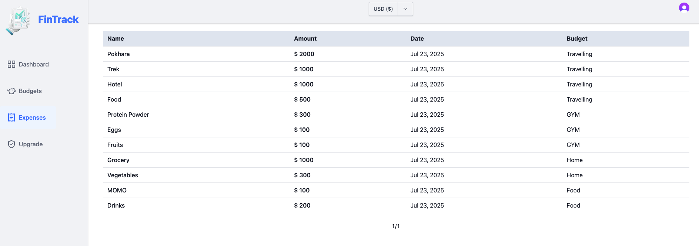

## FinTrack - Expense Tracker Application

FinTrack is a smart and intuitive expense tracker designed to help you manage your finances effortlessly. With real-time insights, budget tracking, and expense categorization, it keeps you in control of your spending. Stay on top of your financial goals and make informed decisions with FinTrack.

## 🚀 Features

- 🧮 **Real-time Budget Tracking**: Set budgets and monitor how much you've spent.
- 📊 **Interactive Charts**: Visual representation of your income, expenses, and budgets.
- 💼 **Budget Management**
  - ➕ Create custom budgets for different categories.
  - ✏️ Edit existing budgets with updated limits or descriptions.
  - 🗑️ Delete unused or outdated budgets anytime.
- 📄 **Paginated Expenses**: View your transactions with pagination for a clean and organized layout.
- 🖥️ **Responsive UI**: Optimized for both desktop and mobile experiences.

## 🛠️ Tech Stack

- **Frontend**: Next.js, TypeScript, Tailwind CSS
- **Database**: PostgreSQL
- **Charts**: Recharts

## 📷 Screenshots

